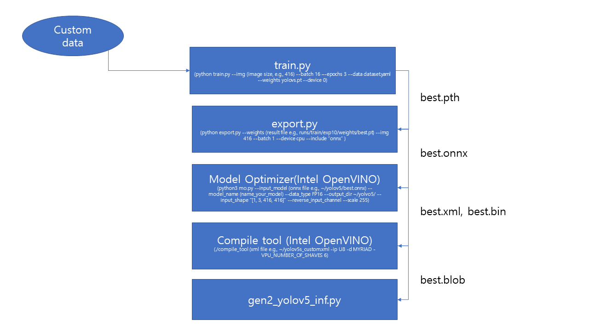

# YOLOv5s-OAK

## 탑재과정


## YOLOv5 Repository
[ultralytics/yolov5yolov5](https://github.com/ultralytics/yolov5)

## Intel OpenVINO
[Donlaod page](https://software.seek.intel.com/openvino-toolkit)

### openvino compile tool 사용시 libinference_engine.so cannot open shared object ~ 문제 생길경우
```
source <INSTALL_DIR>/bin/setupvars.sh -pyver (your_pyversion)
```
## Custom Data
[AIhub 도로주행영상](https://aihub.or.kr/aidata/8007) 중 train/valid -> 도심로 야간일몰_맑음_30_전방, 도심로 주간일출_강우_30_전방, 자동차전용도로_야간일몰_맑음 30_전방, 자동차전용도로 주간일출_안개_30_전방 사용

### YOLOv5 라벨 format
Darknet TXT 라벨 format을 따름 (object-class, x, y, width, height)
object-class: integer number of object from 0 to (classes-1)
x, y, width, height: float values relative to width and height of image, from (0.0 to 1.0)
x, y are the center of rectangle
ex) x = absolute_x / image_width

폴더 안에 각각 train, valid 시 들어갈 이미지들의 경로, 파일명이 포함된 txt파일이 있어야 함(custom_data 폴더 안 train.txt, valid.txt 참조)